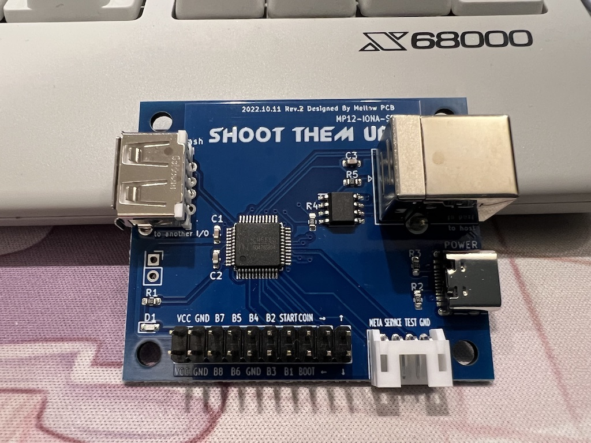

English version is [here](en)

---
# 取扱説明書
---

## 概要
JVS仕様の基板に自作コントローラ等を接続するための基板です。
exA-Arcadiaの高速モードJVS'にも対応しており、この基板を用いてスイッチ直結のコントローラを作成する事で、最高峰の低遅延環境を構築することが可能となります。

## JVSサポート
- [MP01-IONA-JS](https://toyoshim.github.io/iona-js/)や[MP07-IONA-US](https://toyoshim.github.io/iona-us/)と同様に現存するほぼ全てのJVSシステムに対応。電気特定の異なるシステムに対しても追加した専用チップで設定の変更は不要になりました。
- exA-Arcadiaでは高速モードJVS'に対応しているため、理想的な低遅延環境が構築可能です。
- 1プレイヤー専用ですが、デイジーチェーンで複数台接続する事で複数プレイヤーへの対応が可能です。
ホスト側の実装にもよりますが、exA-Arcadiaでは3台以上認識されました。

## 特徴
- 1レバー8ボタンをベースに、コイン、スタート、テスト、サービス、BOOT、METAボタンをサポート
- [レイアウト設定](setting)ページから8種類のボタンレイアウトと連射パタンを登録可能
- 連射はボタンごとに8フレーム周期のON/OFFパターンが定義できるため、連射速度や裏表など細かく設定可能
- 隠し機能として各種ミニハードのUSBコントローラとして動作するモードを搭載

## 設置方法
以下のような2種類の端子が実装されています。
ボタン名の端子とGND端子をペアにして各ボタンに接続して下さい。
BOOTとMETAは設定につかう特殊なボタンになります。

BOOTを押しながら電源を入れるとレイアウト設定やファームウェア更新ができるモードで起動します。
METAはレイアウト切り替えや隠し機能のモード切り替えに使います。

|     |     |     |     |     |     |       |      |     |     |
| :-: | :-: | :-: | :-: | :-: | :-: | :---: | :--: | :-: | :-: |
| VCC | GND | B7  | B5  | B4  | B2  | START | COIN | →   | ↑   |
| VCC | GND | B8  | B6  | GND | B3  | B1    | BOOT | ←   | ↓   |
|     |     |     |     |     |     |       |      |     |     |

|      |         |      |     |
| ---- | ------- | ---- | --- |
| META | SERVICE | TEST | GND |
|      |         |      |     |

推奨する物理ボタン配置は以下の通り。

```
            (BOOT) (COIN) (START)

    |            (2)  (3)  (4)   (META)
  --+--     (1)                  (SERVICE)
    |            (6)  (7)  (8)   (TEST)
            (5)
```

ボタンの少ないコントローラに取り付ける場合は、SERVICEを省略したり、BOOTとMETA、加えてTESTあたりを同じボタンに配線しても良いでしょう。B4とB8を落として6ボタンにするのも手です。

## 使い方（JVS編）
USB Type-Cから電源をとります。
JVSホストとの接続は「to host」と書かれたType-BからType-B <-> Type-AのUSBケーブルで接続します。

複数台を接続する場合は「to another I/O」と書かれたType-Aの端子を使ってデイジーチェーン接続します。
他のI/Oボードを使う場合には相性問題があると思われますので、IONA-SB以外のデバイスとデイジーチェーン接続する事は推奨しません。

## 使い方（USB編）
USB Type-Cで該当ゲーム機に接続します。この際、充電専用ケーブルではなくデータ通信が可能なケーブルを使っているか確認してください。

接続し電源が供給されたら、METAボタンとコインボタン、またはMETAボタンとサービスボタンを押しながら、ボタン1から6のいずれかを押して下さい。ボタンに応じて各種ゲーム機に対応したモードでUSBデバイスとしての動作が開始されます。ボタン番号はレイアウトによらず物理配置に従います。

| ボタン | モード |
| ------| ----- |
| 1     | NEOGEO mini
| 2     | メガドライブミニ / メガドライブミニ2 / アストロシティミニ / アストロシティミニV /<br> イーグレットツー ミニ / X68000Z
| 3     | PCエンジン mini / X68000Z
| 4     | プレイステーション クラシック
| 5     | Retro-bit GENERATIONS 4
| 6     | THE C64 MINI / A500 MINI

その他、Evercade VSはNEOGEO miniモード以外の全てのモードで利用できます。

## レイアウトの切り替え
METAボタンを押しながらボタン1から8のいずれかを押して下さい。ボタン番号に応じたレイアウトに切り替わります。
ボタン番号はレイアウトによらず物理配置に従います。

## ファームウェア
IONA-US同様にファームウェア更新が可能です。アップデート希望の方は個別にご連絡ください。IONA-SBではMellow PCBから出荷されたボード以外ではアップデート用のファームウェアを書き込んだだけでは動作しないよう特殊なファームウェア構成になっています。他の書き込みツール等を利用した際は出荷設定が必要になる可能性がありますのでご注意下さい。

- Ver 1.00 初期出荷版
- Ver 1.01 USBモード変更時に同時にレイアウトが切り替わらないよう修正
- Ver 1.02 2Pサポートをしているフリをするレイアウト設定を追加

## 問い合わせ
[Twitter](https://twitter.com/toyoshim)などでご連絡下さい。
