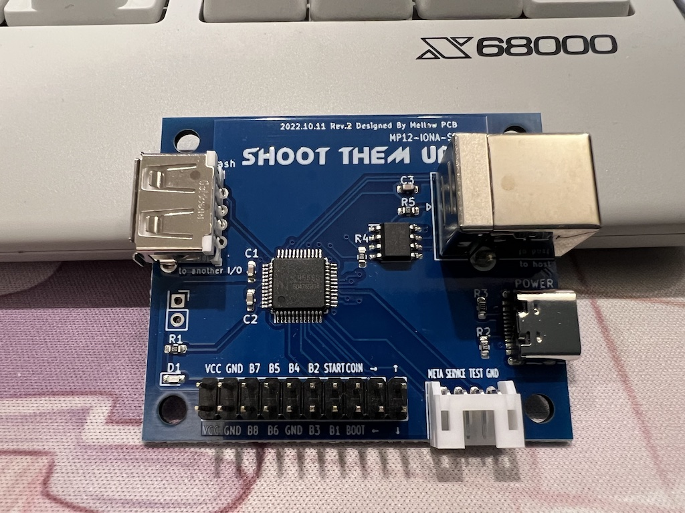

日本語版サイトは[こちら](./)

---
# Manual
---

## What's this?
It's a PCB that allows you to create your own arcade stick that speaks JVS for
JVS based arcade systems.
As it supports JVS', an extended JVS to support faster mode on exA-Arcadia, you
can create an ideal arcade stick that doesn't cause any input lag.

## JVS Compatibility
- As [MP01-IONA-JS](https://toyoshim.github.io/iona-js/) and
 [MP07-IONA-US](https://toyoshim.github.io/iona-us/) does, it supports almost
 all JVS based arcade systems.
 As IONA-SB uses an additional chip to speak JVS protocol, you don't need any
 software setting to mitigate and to adjust electrical characteristics. It will
 just work.
- You can realize an ideal play environment with no lag to play JVS' titles on
 exA-Arcadia.
- One board supports only 1 player, but it has another downstream JVS port to
 connect with anbother board each other. Thus, daisychain connection allows you
 to suppolrt multi-players.

## Features
- Support 1 lever 8 buttons controler with coin, start, test, service, BOOT, and META buttons.
- You can memorize 8 configurations that arrange button map and rapid-fire settings at [Settings](setting__en) site.
- You can edit rapid-fire patterns over 8frames at maximum so that you can realize the speed, and timing, e.g. for back beat shots.
- As a secret bonus, it supports USB gamepad mode for various mini hardwares.

## Installation
There are 2 kind of pinouts as shown below.
You need to connect a pair of pins, the button name pin and GND pin, to a switch respectively.
BOOT and META are special buttons to change IONA-SB settings.

When it boots with the BOOT button pressed, the board enters a special mode to
modify settings, or to update firmware.

META button is used to switch button maps or USB gamepad modes.

|     |     |     |     |     |     |       |      |     |     |
| :-: | :-: | :-: | :-: | :-: | :-: | :---: | :--: | :-: | :-: |
| VCC | GND | B7  | B5  | B4  | B2  | START | COIN | →   | ↑   |
| VCC | GND | B8  | B6  | GND | B3  | B1    | BOOT | ←   | ↓   |
|     |     |     |     |     |     |       |      |     |     |

|      |         |      |     |
| ---- | ------- | ---- | --- |
| META | SERVICE | TEST | GND |
|      |         |      |     |

Here is a recommended physical layout.

```
            (BOOT) (COIN) (START)

    |            (2)  (3)  (4)   (META)
  --+--     (1)                  (SERVICE)
    |            (6)  (7)  (8)   (TEST)
            (5)
```

If you install the board to a controller that doesn't have less buttons, you could omit the SERVICE button for instance, or you can connect BOOT and META, and even TEST to a same button.
You may drop B4 and B8 for 6 button systems.

## How to use (for JVS)
USB Type-C is used to give 5V power.
USB Type-B with a label 'to host' is used for JVS systems. You can use USB Type-B <-> Type-A cables to connect it to a JVS host.

If you want to use multiple IONA-SB to support multi-players, you can use the other Type-A connector to be connected with another board. As JVS I/O boards from several companies are diverse, IONA-SB doesn't support other models produced from other companies.

## How to use (for USB)
USB Type-C is also used for USB communication in addition to the bus power supply.
You should ensure that your cables support communication.

Once the board is connected over USB, presing META and coin, or META and service, with one more button from 1 through to 6. It will start USB device mode in the selected mode by the button.
The button numbers ignore button mapping, and follow the physical layout.

| Button | Mode |
| ------| ----- |
| 1     | NEOGEO mini
| 2     | Genesis Mini / Genesis Mini 2 / Astrocity Mini / Astrocity Mini V /<br> EGRET II mini
| 3     | TurboGrafx-16 mini
| 4     | PlayStation Classic
| 5     | Retro-bit GENERATIONS 4
| 6     | THE C64 MINI / A500 MINI

Also, Evercade VS doesn't work only with NEOGEO mini mode, but works fine with other modes.

## Choose a button map
You can press one of buttons 1 to 8 while pressing META button. The map is changed to one that the button number indicates. The button number is basdd on the physical layout.

## Firmware
Firmware update page will be published in the future as I did for IONA-US.
I inject several tricks to the firmware so that it works only with the official board as there were several illegal clones from China. I haven' permitted such clones even though the firmware was an open source project.

- Ver 1.00 Initial version only available in Japan
- Ver 1.01 Initial version for international version
- Ver 1.02 Add a layout option to pretent supporting 2 players

## Contact
Please contact me over [Twitter](https://twitter.com/toyoshim) or other socials.