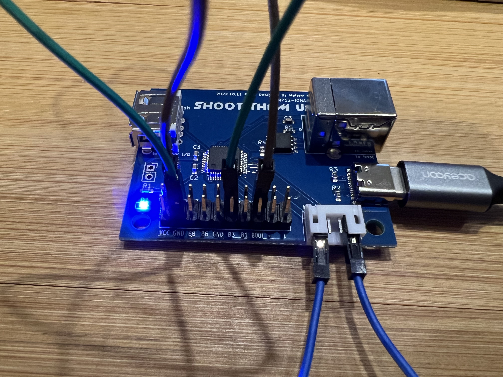

# Trouble Shooting
---
## Bricked or Not Bricked
Connect the Type-C to a power supplier, such as a charger or a PC.
You will see the LED is blinking.

Since the factory set of the firmware is written through the Type-C port over
USB protocol, this step is expected to work unless the device got broken
on shipping.

This process ensures the microcontroller is running, and the LED is alive.

## USB connection
Contact the GND pin and the BOOT pin, and connect the Type-C to a PC or a mac.
You need to use a USB cable that also supports data communication.
This time, the LED should keep off.

You will see a USB device that has vendor ID 4348 and product ID 55E0.

See also [WinUSB Setttings (only for the first time on Windows)](https://toyoshim.github.io/iona-us/firmware_en) to know how to find the device.

For mac, [System Information](https://support.apple.com/guide/mac-help/get-system-information-about-your-mac-syspr35536/mac) is available to check the
connected USB devices.

This process ensures the USB wiring and the microcontroller can control USB.
Also the BOOT pin is correctly wired.

You may also try the [Layout Settings](setting_en) page and check if the page
can communicate with the device.

This should also work.

## Try USB gamepad mode
Contact the GND pin and the META pin, the GND pin and the COIN pin, and the GND
pin and the B2 pin. The emulates pressing META, COIN, and B2 buttons. With these
being pressed, connect the Type-C to a PC or a mac. LED will blink.

Now the IONA-SB will appear as a USB gamepad, "6B controller". This is comatible
with GENESIS mini gamepad.

For Windows users, [here](https://www.youtube.com/watch?v=gFnEiScFQ2U) is a
movie that shows how to install a proper driver and to check button inputs.

mac doesn't need anything to recognize the gamepad.

To check the buttons over web browser,
[HTML5 Gamepad Test](https://greggman.github.io/html5-gamepad-test/) page will
be useful. Note that the page cannot show the device until the button state is
changed. So, you may detach the wire among the pin pairs. Also, X axis doesn't
seem to work at the page.

This step allows you to check if the pinouts are alive. But as the IONA-SB
emulates the 6 button pad, you can check only a subset of the all buttons.

|IONA-SB buttons|6B controller|
| :-: | :-: |
| B1 | 3 |
| B2 | 0 |
| B3 | 4 |
| B4 | NA |
| B5 | 2 |
| B6 | 1 |
| B7 | 5 |
| B8 | NA |
| COIN  | 8 |
| START | 9 |
| LEFT/RIGHT | Axes 3 |
| UP/DOWN    | Axes 4 |
| TEST | NA |
| SERVICE | NA |
| META | NA |

## JVS
Supply power over Type-C and connect the JVS port to the host arcade pcb.

If it keeps blinking, the JVS is not recognized by the host.

If the patterns change, IONA-SB recognizes some commands from the host. Once the
negotiation among the host and IONA-SB is done, it stops blinking and keeps the
light on. This means the JVS works fine.

If the title still doesn't recognize the IONA-SB, the title may reject unknown
devices and only permits devices listed in their allowlist. As JVS is flexible
and has a way to check capabilities, such as the number of supportted buttons,
analog inputs, or other special kinds of input or output signals, some games
explicitly reject or ignore unknown or incompatible devices that doesn't have
enough buttons, or have too much features.

Especially, the IONA-SB declares a higher protocol version to support JVS dash
as the exA-Arcadia's JVS dash spec requires, legacy systems may not work with
IONA-SB.